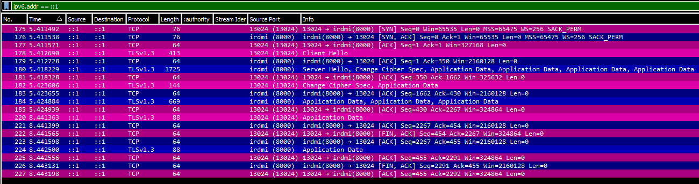

# 01-echo-server

This example is based of the documentation about the [`node:tls`](https://nodejs.org/api/tls.html)
module of Node.js and further improved.

This example handles connections sequentially. This means only one connection can be hold at all
time.

- Creates a secure dumy echo socket server.
- On connect check if server is authorized as well as client (In this example only server is).
- After socket client establishes a secure connection over TLS, the server sends one message to the
  client.
- Client closes 3 seconds after first message was recieved from server gracefully.

## Generate Selfsigned Certificate and Keys

Generate server private key file (in PEM format) and signed server certificate file (in PEM format
too).

**The private key must be keept secert, and not shared with ANYONE. If this key gets
leaked, all past and future traffic can be decrypted.**

The certificate will be handed out on every TLS-Server-Hello and acts like your Passport or ID,
identifying who you are.

**Important:** **`CN`** or **`Common Name`** must be `localhost.`, when executing localy. In
production this would be the hostname (FQDN) of socket server (Validate if claims of server are
true).

```sh
cd ./server/certificates/
openssl req -newkey rsa:2048 -nodes -keyout key.pem -x509 -days 365 -out certificate.pem
cd ../..
```

## Execution

After generating the server private key and certificate:

- Start the server, from the path where this `README.md` doc is located, with `node server`
- In a seperate terminal session, start the client with `node client`.
- When the client finished execution, another client can be started - until the server is killed
  with `Ctlr-c`.

## Traced packets in Wireshark

Wireshark TCP session of client connecting to server, server responding and client closing the
connection. Packets are colord by these rules:

- pink is request, light pink request with TLS data
- blue is response, light blue response with TLS data


